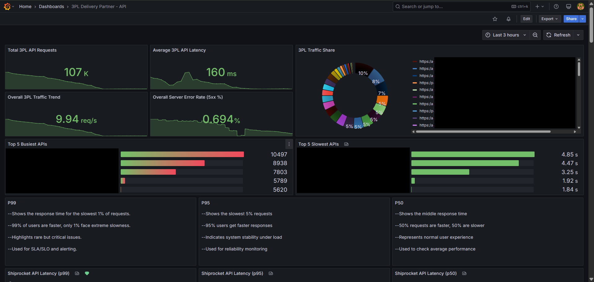
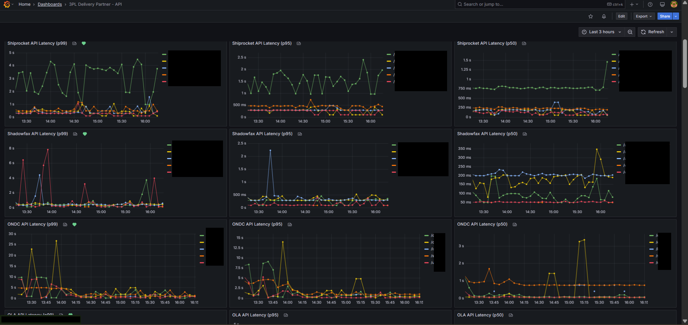
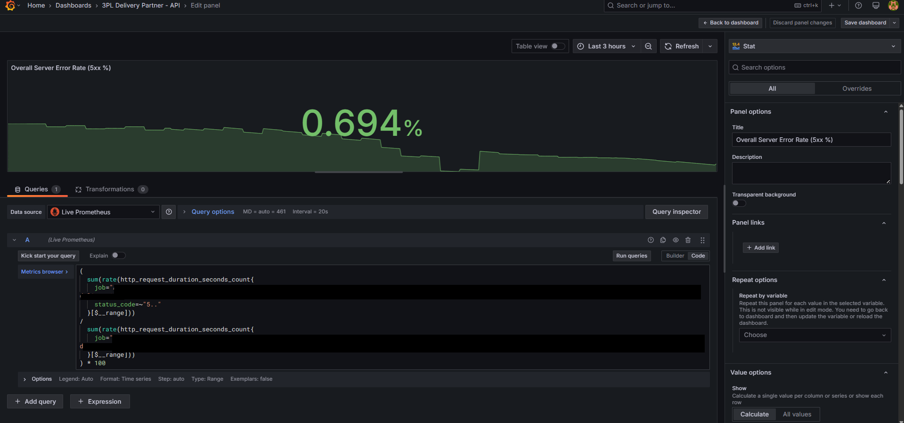
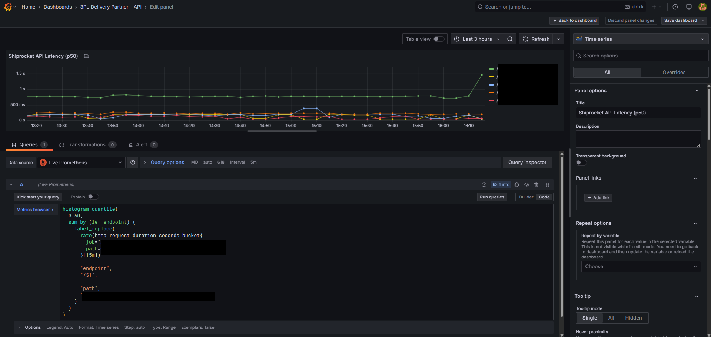
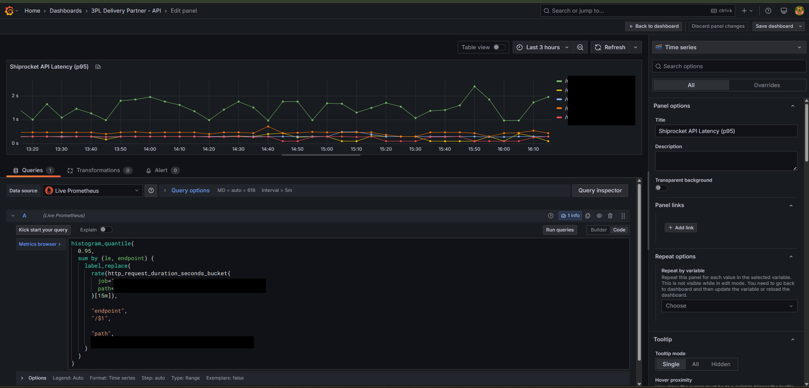
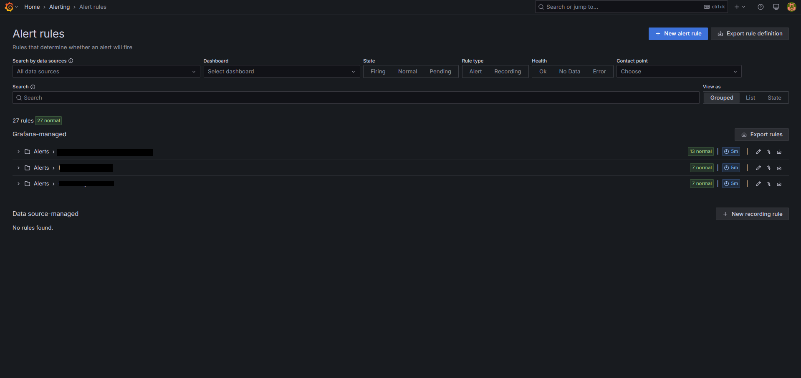
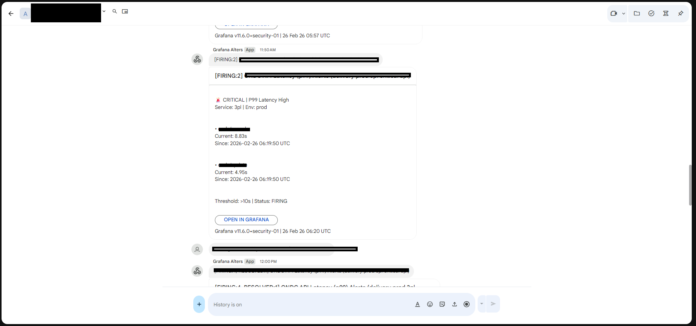

🚀 Production API Observability Dashboard

Designed and implemented a production-grade observability system
for monitoring high-volume API traffic integrating multiple
third-party logistics providers.

Features

- P50 / P95 / P99 latency monitoring
- 5xx error rate tracking
- Top 5 busiest APIs
- Top 5 slowest APIs
- Traffic share visualization
- Per-provider latency breakdown
- SLO-focused panels

Tech Stack

- Grafana
- Prometheus
- PromQL
- Histogram-based metrics

Key Concepts Used

- histogram_quantile()
- rate() / increase()
- label_replace()
- topk()
- Percentile-based alerting
- SLO monitoring

Dashboard Preview

Overall Dashboard Overview

---

Error Rate Monitoring

---

Percentile Monitoring (P50 / P95 / P99)

---

Alerting Example

> Note: All service names and endpoints have been anonymized for confidentiality.
